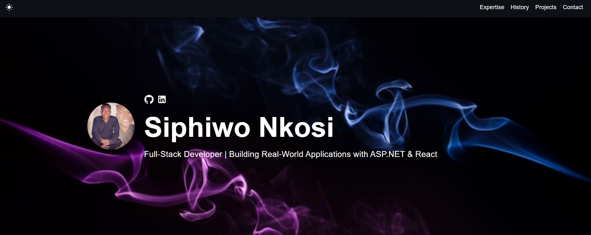

# Digital Portfolio

      

## What is this?

This simple portfolio is designed to showcase career history, skill sets, past projects, and more.

View the [Live](https://nkosi-code.github.io/portfolio/).

**This template is free to use, and no attribution is required.** You can fork or download this repository to customize it for your own use.

 

## Features

✅ Open source (free to use, no attribution required). 
✅ Responsive design & mobile-friendly.
✅ Supports both dark and light modes .
✅ Highly customizable multi-component layout.   

## Quick Setup
1. Ensure you have [Node.js] installed. Check your installation by running:

```bash
node -v
```

2. In the project directory, do the following:
```bash
npm install
npm start
```

3. Customize the template by navigating to the /src/components directory. Modify texts, pictures, and other information as needed.

The page will reload if you make edits, and you will see any lint errors in the console.

## Deployment 
You can choose your preferred hosting service to deploy your portfolio, such as GitHub Pages, Netlify, Vercel, or any other static site hosting provider.

If deployed from GitHub Pages, ensure to update the `homepage` field in `package.json` to match your repository URL:
```json
{
    "homepage": "https://yourusername.github.io/your-repo-name",
    "scripts": {
        "predeploy": "npm run build",
        "deploy": "gh-pages -d build",
        ...
    }
}
```
Replace `yourusername` with your GitHub username and `your-repo-name` with the name of your repository.
